# Travel Trends in Singapore
This github repository consists of our machine learning project for module code INF2008.

## Problem Statement
This study aims to predict air passenger traffic volume to and from Singapore by analyzing historical arrivals, departures, number of public holidays in each month and inflation. By leveraging machine learning techniques, the research seeks to identify peak and off-peak travel periods, enabling airlines, travel agencies, and policymakers to optimize flight schedules, allocate resources efficiently, and enhance passenger experience. 

## Dataset
Our datasets that we decided to use are from the department of statistics singapore (singstat.gov.sg).

Departure: https://tablebuilder.singstat.gov.sg/table/TS/M650641

Arrivals: https://tablebuilder.singstat.gov.sg/table/TS/M650631

Inflation: www.timeanddate.com 

Inflation: https://www.kaggle.com/datasets/sazidthe1/global-inflation-data 

## Data Preprocessing 

Raw datasets are often structured in ways that make them difficult to analyze directly. In this project, we performed several preprocessing steps to make the data more suitable for analysis and modeling. These steps included:

- Reshaping data (Melting)

The original datasets for arrivals, departures and global inflation data was in a wide format so to make it easier to work with, we melted it to a long format using the following transformation:
```bash
    df_long = df.melt(id_vars=["Data Series"], var_name="Month_Year", value_name="Arrivals")
  ```

Refer to preprocessing/preprocessing.ipynb

- Web Scraping for Holiday 

Since the data was not readily available in a structured format, we collected the singapore holidays for the different years through web scraping.

Refer to preprocessing/Singapore_holidays.ipynb

## EDA

Refer to EDA/data_visualization.ipynb

In this section, we will perform Exploratory Analysis Data to gain insights on the relationship between features and the data itself to justify if the features are useful.

### Correlation Heat Map 

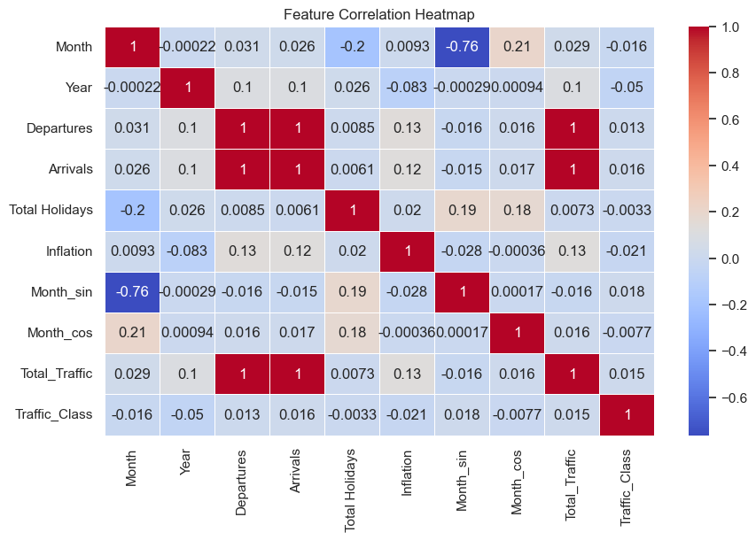

This graph is to present linear relationships between features. However after anlysising it, we discovered that the features does not have a strong relationship to one another. 

### Scatter Plot Holidays vs Total Traffics 

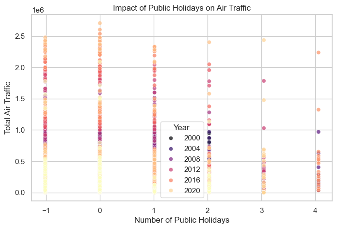

This analysis is to show the relationship and data dsitribution of total traffic across the years against number of public holidays. Although it does not show strong relationship or pattern, we can tell that more traffic resides during lesser holidays.

### Scatter Plot Inflation vs Traffic 

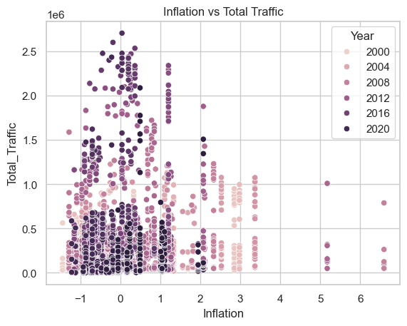

This analysis is to show the relationship and data dsitribution of total traffic against inflation rating. This shows a strong relationship where more flights occurs when inflation were low.

### Line Plot Arrivals last 10 years

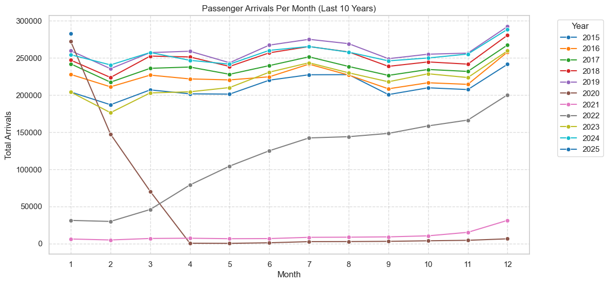

This analysis is to show the relationship and data distribution of total traffic against inflation rating. This shows a strong relationship where more flights occurs when inflation were low.

## Feature Engineering

After cleaning the data and exploring the relationships between features using EDA. we proceeded with feature engineering stage where we select and created new features to be used for our later stages.

Feature added: 'Month_sin', 'Month_cos'

The Month column is converted into cyclic features using sine and cosine transformations. The reason for this transformation is that months are cyclical — December (12) is followed by January (1) — and treating them as a linear feature (e.g., just using 1 to 12) would lose the periodic nature of time.

The formula for each is shown below:

<p align="center">
    Month<sub>sin</sub> = sin( (2π × Month) / 12 )
</p>

<p align="center">
    Month<sub>cos</sub> = cos( (2π × Month) / 12 )
</p>

Feature added: 'Total_Traffic'

We added a new column that contains the value of the sum of 'Arrivals' and 'Departures'.

Selecting of features: We decided to use the newly added features, along with 'Year', 'Inflation' and 'Country' and 'Total Holidays' as from EDA, they have relatively strong relationship to total traffic volume. 

Refer to Classification/feature_engineering.ipynb

## Clustering

In this stage, we opt for KMeans as it is simple and fast to implement. To find the optimal number of clusters to use as the k-value, we used the elbow method. 

From the graph below, there is a 'bend' when k value is 3. 

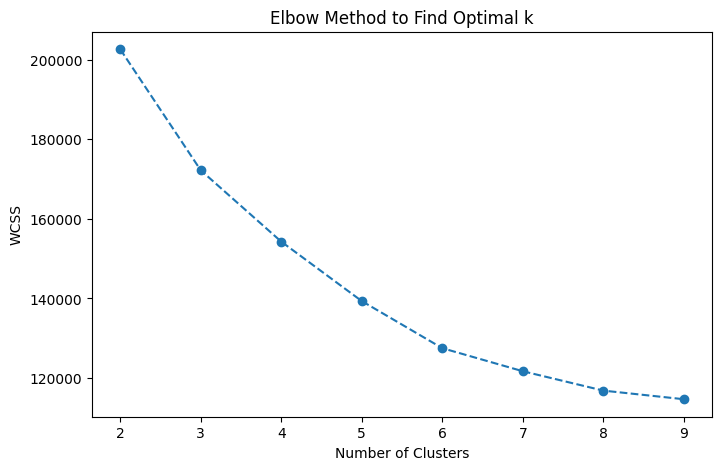

However, it is not really clear whether 3 is really the best number to select so we also did a calculation of the silhouette score which can be useful tin finding the number of K when the elbow method doesn’t show a clear elbow point.

Typically, we will take the higher score once the elbow bends. 
From the scores, we can see that 3 is still the best one so we will take k value as 3 to perform our KMeans clustering. 

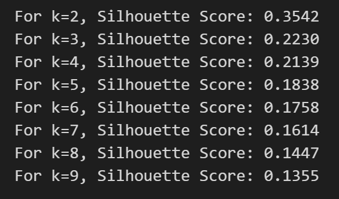

After performing KMeans, the labels are updated into our final dataset and saved into the column 'Traffic_class' which will be the target variable that we will input into our models later. 

We then plot a box-plot to visualise the difference between each cluster. From the graph, we can see that Cluster 0 represents low traffic volume, Cluster 1 represents high traffic volume and Cluster 2 is in the middle.


Refer to Clustering/clustering_kmeans.ipynb

## Classification

Finally, after generating the labels and updating our dataset, we went on to create and train models that could assist us with the classification task.

We first defined the features that we are going to use (X) : 'Total_Traffic', 'Departures', 'Arrivals', 'Traffic_Class', 'Month'

Our target variable (y) will be 'Traffic_Class'

We tried to implement several models.

1. Random Forest (Classification/randomforest.ipynb)

Random Forest is an ensemble learning approach and are more likely to be resilient to noise. 
The initial baseline accuracy of the test dataset after training is around 67% which is quite low so we made use of grid search to help us fine-tune the hyperparameters such as :

**n_estimators** : Specifies the number of decision trees. Higher values can increase model stability and reduces variance.
**max_depth** : Limits how deep each decision tree can grow. Higher depth captures more complex patterns

**max_features** : Determines how many features are randomly selected at each split.
**min_samples_split** : Represents the minimum number of samples required to split an internal node in a decision tree. Higher values prevent overfitting.

**min_samples_leaf** : Represents the minimum number of samples that must be present in a leaf node.
Setting a higher leaf size ensures the model focuses on meaningful patterns rather than noise.

**max_samples** : Proportion of the dataset sampled for each tree.
By lowering the values, increases tree diversity and reduce overfitting.

After fine-tuning, we ran the classifier against the training and testing dataset again, and realised that the accuracy has improved significantly from 67% to 86%. 
We then thought of using **SHapley Additive exPlanations (SHAP)** to help us interpret the model better and found that for Cluster 1, Inflation has a strong negative SHAP value, which shows that higher inflation reduces the predicted traffic volume.

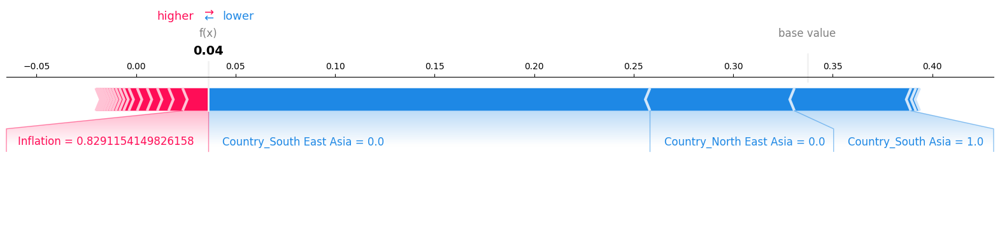

The top features for each cluster reveal that "Country_South East Asia" is the most influential across all classes, especially for Class 1 and Class 2. "Year" consistently appears, indicating that time trends impact predictions. Inflation also plays a key role in differentiating low and high traffic volume clusters (Class 0 vs. Class 1).

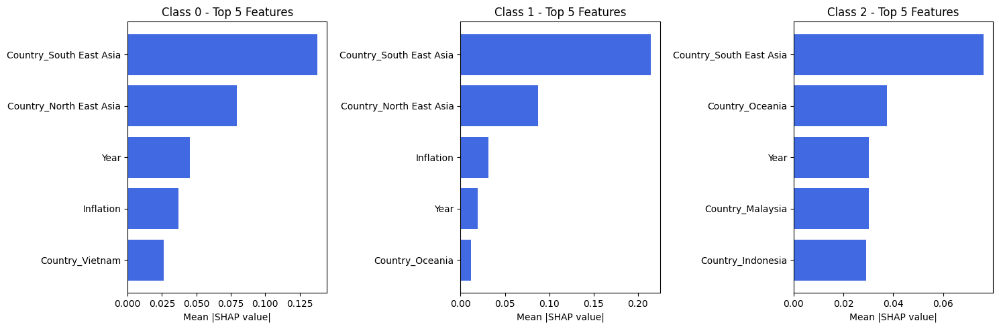

2. XGBoost (Classification/xgboost.ipynb)

We also tried XGBoost which is an optimized gradient boosting algorithm that improves predictive performance by combining multiple weak learners (typically decision trees). It is designed for speed and efficiency.

The initial baseline accuracy of the test dataset after training is around 67% which is quite low so we made use of grid search to help us fine-tune the hyperparameters using gridsearch such as :

n_estimators: Defines the number of decision trees in the model.
Higher values can improve accuracy but may lead to overfitting.

max_depth : Controls how deep each tree can grow.
Deeper trees capture more complex patterns but may overfit.

learning_rate : Determines how much each tree contributes to the final prediction.
Lower values make learning slower but more stable.
Higher values learn faster but risk missing optimal solutions.

subsample : Controls random sampling of training data before growing each tree.
Lower values help prevent overfitting.

colsample_bytree : Controls random feature selection for training each tree.
It helps reduce correlation between trees, improving generalization.

After fine-tuning the accuracy increased to 69% but balanced accuracy was a decrease to 55%.
Hence, to ensure our samples are more balanced, we tried using SMOTE (Synthetic Minority Over-sampling Technique) which is a data augmentation technique used to address class imbalance in classification problems. It generates synthetic samples for the minority class rather than simply duplicating existing ones, helping machine learning models learn better from imbalanced datasets.

We trained and tested the model after applying SMOTE and found that accuracy improved slightly, increasing to 69%.

Still using SHAP to explain our classifier decisions, we plotted a force plot. 

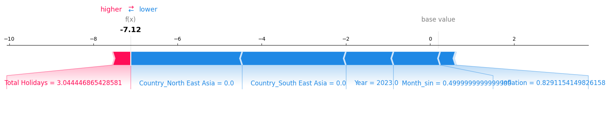

The force plot above shows that total Holidays pushed the prediction higher while inflation, region, year, and month pushed the prediction lower.
This suggests that economic conditions (inflation) and seasonal effects (year/month) reduce traffic, while holidays increase it.

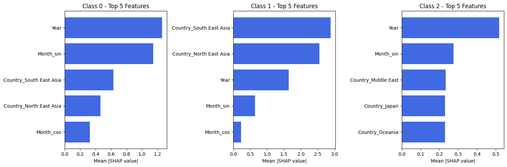

The bar graphs plotted show the top features plotted for each class and we can see that time-related features like Year, Month_sin, and Month_cos are consistently influential across all classes and geographical features affect traffic volume significantly, though their importance varies by class.

3. Logistic Regression (Classification/logistic_regression.ipynb)

Logistic Regression was implemented to predict traffic classes using one-hot encoding for categorical variables instead of label encoding, which improved interpretability and model performance. This approach allowed us to capture categorical relationships without imposing artificial ordinality.

We developed three variants of logistic regression models with increasing sophistication:

- **Base Logistic Regression**: Standard model with default parameters achieved a baseline accuracy of 92.87% on test data. This model provided a solid foundation with a relatively simple structure and demonstrated that even a basic implementation could achieve strong results, indicating that our feature selection was effective.

- **Tuned Logistic Regression**: Enhanced the base model by optimizing hyperparameters through GridSearchCV. We tuned parameters including:
  - `C`: Regularization strength (tested values: 0.1, 1, 10, 100) to control overfitting
  - `solver`: Algorithm for optimization (tested: 'lbfgs', 'newton-cg') to improve convergence
  - `class_weight`: Class weighting strategy (tested: None, 'balanced') to address class imbalance
  
  The optimal parameters found were C=10, solver='lbfgs', and class_weight='balanced', which effectively handled the class distribution in our dataset. This model achieved the best overall performance with 96.88% test accuracy and excellent class balance (Class 0: 95.5%, Class 1: 97.4%, Class 2: 100%). The improvement over the base model demonstrated the importance of proper hyperparameter tuning.

- **Logistic with Enhanced Features**: Built upon the tuned model by adding polynomial feature interactions (degree=2, interaction_only=True). This increased the model's complexity and flexibility by allowing it to capture non-linear relationships between features. While this achieved the highest validation accuracy (89.66%), it performed slightly worse on test data (93.32%) and struggled with Class 2 predictions (62.8% accuracy). This performance drop indicates potential overfitting, suggesting that the simpler tuned model might generalize better to unseen data.

Cross-validation with 10 folds confirmed the model's stability with a mean accuracy of 90.50% and a low standard deviation (1.24%), indicating consistent performance across different data subsets.

#### Confusion Matrix Analysis


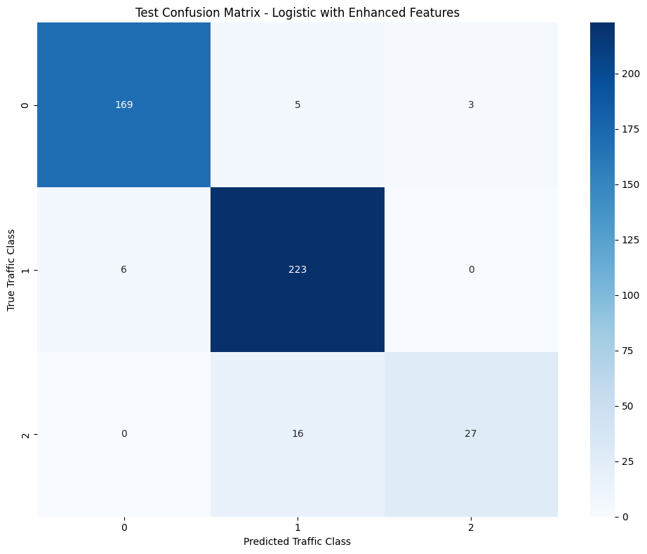

The confusion matrices reveal several important patterns:

- **Base Model Performance**: The base model correctly classified most instances but showed some confusion between classes. It misclassified 27 instances total, with most errors occurring between Class 0 and Class 1 (20 instances of Class 0 predicted as Class 1). It achieved perfect prediction of Class 2, suggesting this class was distinctly separable.

- **Tuned Model Improvements**: The tuned model substantially reduced misclassifications to just 14 instances, cutting errors by nearly 50%. It especially improved Class 0 prediction, reducing errors from 27 to 8 instances, while maintaining perfect prediction for Class 2. This suggests the balanced class weights helped address the previous bias toward the majority class.

- **Enhanced Model Tradeoffs**: The enhanced features model showed mixed results. While it maintained good performance for Classes 0 and 1, it struggled specifically with Class 2, incorrectly classifying 16 instances (37%) as Class 1. This suggests that the added polynomial features created confusion between medium and high traffic patterns, possibly by overemphasizing certain feature interactions.

#### SHAP Analysis for Model Explainability

We conducted SHAP (SHapley Additive exPlanations) analysis to interpret feature importance, which revealed distinct patterns for each traffic class:

**Class 0 (Low Traffic Volume):**
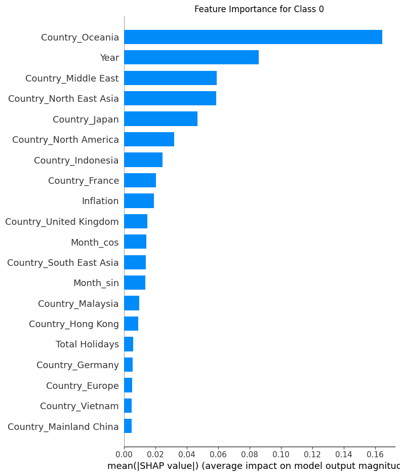
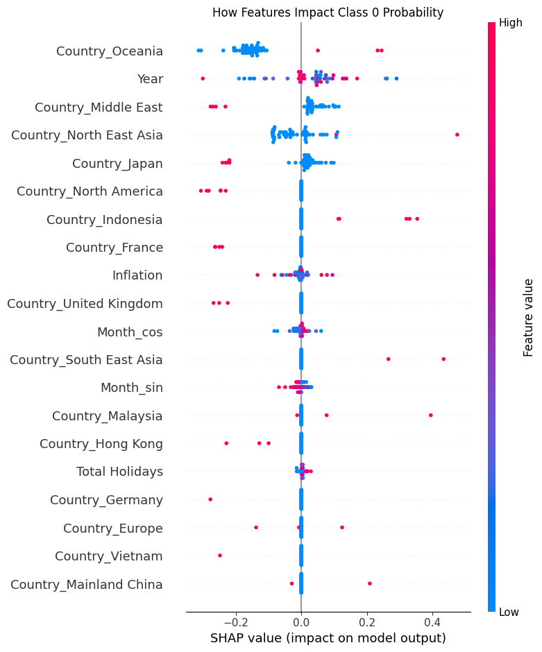

For Class 0 (low traffic), Oceania was by far the most influential feature, with more than twice the impact of any other feature. The SHAP impact plot shows that lower values of Oceania (blue dots on the left side) pushed predictions toward Class 0, suggesting that low traffic from Oceania was a strong indicator of overall low traffic. Year was the second most important feature, with its impact varying significantly across different years, potentially capturing economic cycles or major events affecting travel patterns.

**Class 1 (High Traffic Volume):**
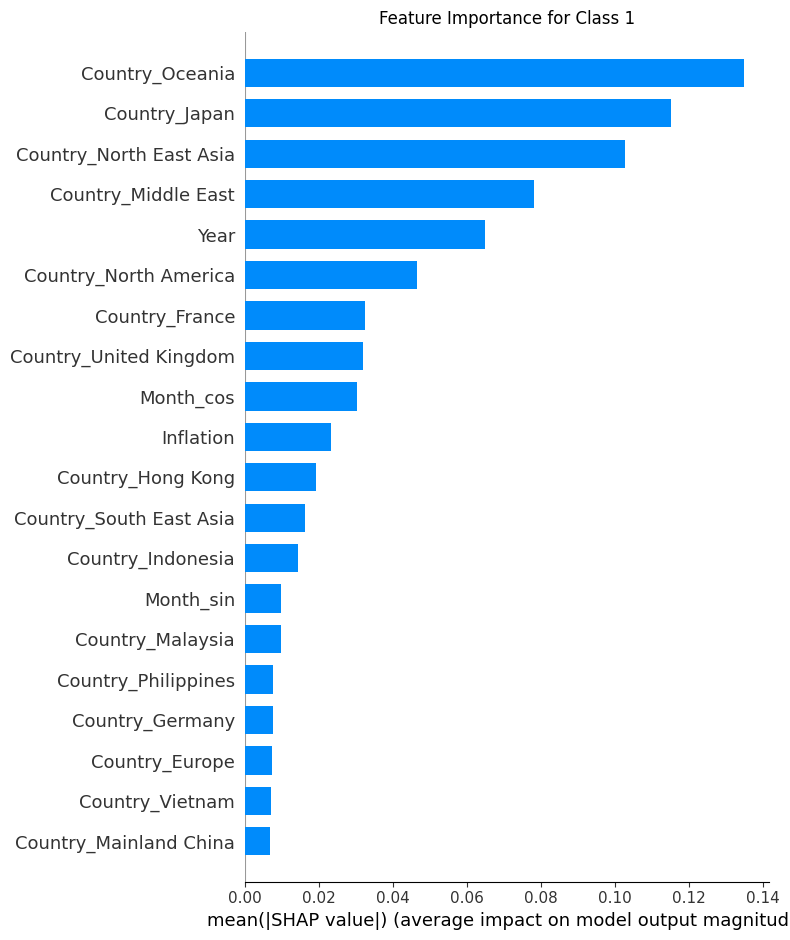
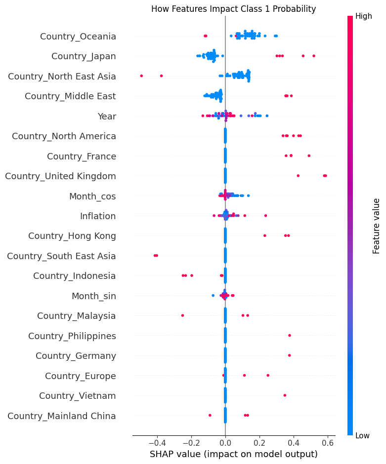

For Class 1 (high traffic), three major regions dominated the predictions: Oceania, Japan, and North East Asia. The impact plot shows that higher values for these regions (red dots on the right side) substantially increased the probability of Class 1 prediction. Interestingly, North East Asia showed both positive and negative impacts, with some values decreasing Class 1 probability, suggesting that traffic patterns from this region were more complex than simply high or low. The Middle East region also emerged as an important predictor for high traffic.

**Class 2 (Medium Traffic Volume):**
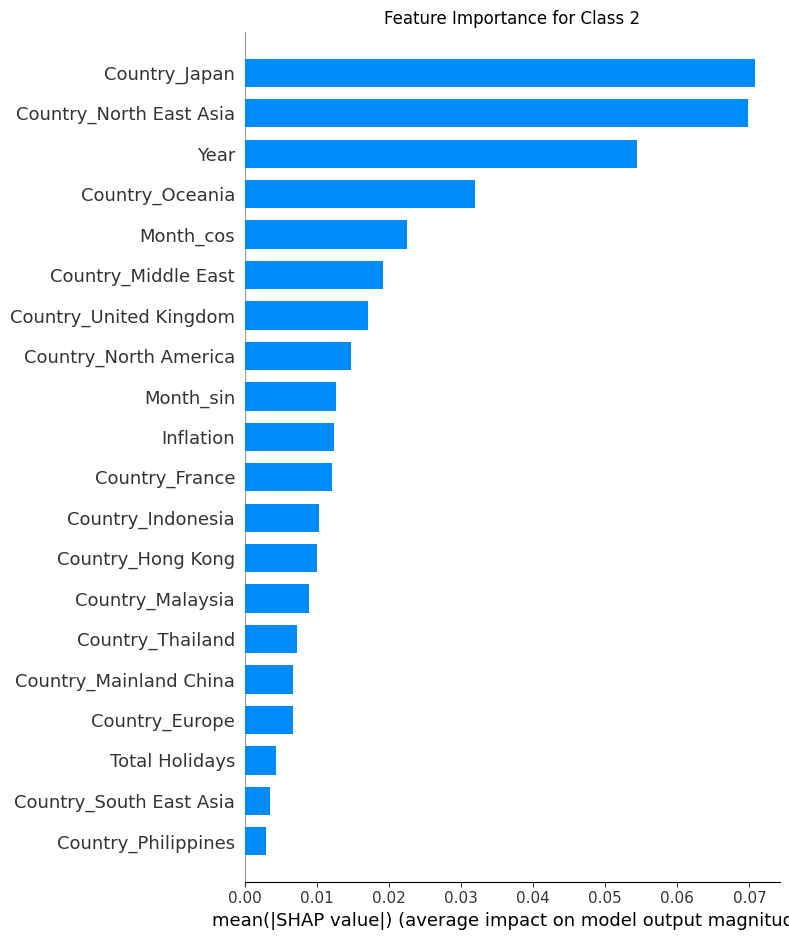
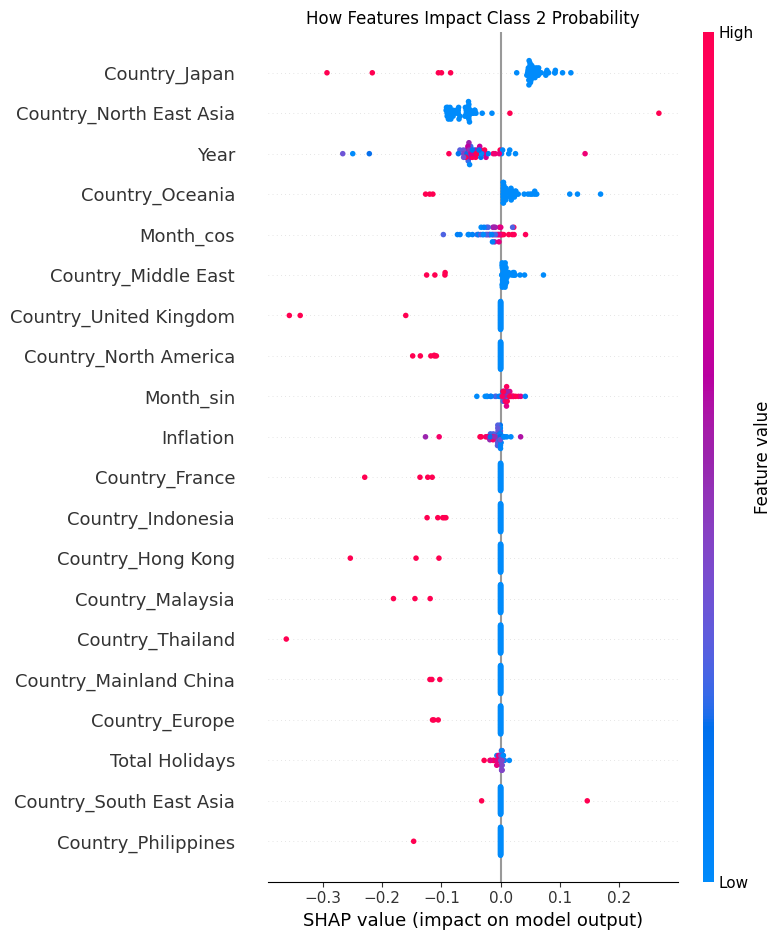

For Class 2 (medium traffic), Japan and North East Asia were the dominant predictors, far outweighing other features. The impact plot reveals that specific values of these features (clustered dots in the center-left) were strongly associated with medium traffic patterns. Year showed a more uniform distribution of impacts, suggesting that medium traffic patterns had consistent temporal characteristics across the time period. The cyclic feature Month_cos also played a significant role, indicating that medium traffic had stronger seasonal patterns than the other classes.

**Comparative Feature Importance:**
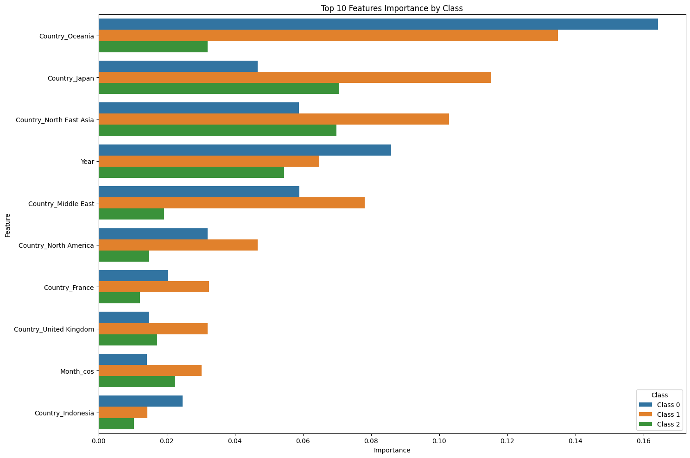

The comparative analysis clearly shows how different features drive predictions for each traffic class:

- **Oceania** is the dominant predictor for Classes 0 and 1, but less important for Class 2
- **Japan and North East Asia** are critical for Class 2, important for Class 1, but less influential for Class 0
- **Year** maintains consistent importance across all classes, ranking in the top 5 features for each
- **Middle East** shows moderate importance for Classes 0 and 1 but less for Class 2
- **Seasonal indicators** (Month_sin, Month_cos) have varying importance across classes, with Month_cos being particularly important for Class 2

Key insights from SHAP analysis:

1. **Geographic Specialization**: Each traffic class is associated with specific geographic regions:
   - Class 0 (low traffic): Strong negative association with Oceania
   - Class 1 (high traffic): Strong positive associations with Oceania, Japan, and North East Asia
   - Class 2 (medium traffic): Dominated by specific patterns from Japan and North East Asia

2. **Temporal Patterns**: Year's consistent importance across all classes indicates significant temporal trends in air traffic patterns, possibly reflecting:
   - Long-term growth trends in air travel
   - Impact of economic cycles on travel demand
   - Effects of specific events (e.g., global health events, economic crises)

3. **Regional Seasonality**: The varying importance of Month_sin and Month_cos across classes suggests different seasonal patterns by region:
   - Class 2 shows stronger seasonality (higher Month_cos importance)
   - This may reflect tourism seasons, holiday patterns, or business travel cycles specific to certain regions

4. **Feature Interactions**: The SHAP impact plots reveal complex interactions, with some features showing non-linear or conditional effects depending on their values

The Tuned Logistic Regression model offered the best balance of performance, generalizability, and interpretability, making it our preferred model for this classification task. While the Enhanced Features model captured more complex relationships, its tendency to overfit Class 2 data made it less reliable for production use. The SHAP analysis provided valuable insights into the geographic and temporal factors driving Singapore's air traffic patterns, which could inform strategic planning for airlines, tourism agencies, and airport authorities.

4. Decision Tree (Classification/decisiontree.ipynb)

### Model Design & Implementation

#### 1. Baseline Model (Untuned Decision Tree)
- **Initial Model**: Used **`DecisionTreeClassifier(random_state=42)`**.
- **Evaluation**: Measured **training accuracy** and **10-fold cross-validation score** to establish baseline performance metrics before hyperparameter tuning.

#### 2. Hyperparameter Tuning with GridSearchCV
- **Grid Search**: Performed an exhaustive search over the following hyperparameters:
  - `max_depth`: Limits tree depth to avoid overfitting.
  - `criterion`: Split criterion (`gini` or `entropy`).
  - `splitter`: Node splitting strategy (`best` or `random`).
  - `min_samples_split`: Minimum samples required to split a node.
  - `min_samples_leaf`: Minimum samples required per leaf node.
  - `max_features`: Feature selection strategy (`sqrt`, `log2`, or `None`).
  - `min_weight_fraction_leaf`: Minimum weighted fraction of samples in a leaf.
  - `class_weight`: Handles class imbalance (`balanced` or `None`).
- **Best Parameters**: Chose optimal hyperparameters using **5-fold cross-validation**.
- **Final Model**: Trained the model with the selected hyperparameters.

#### 3. Model Evaluation
- **Untuned vs. Tuned**: Compared performance of both untuned and tuned models:
  - **Training Set**: Evaluated **accuracy** and **cross-validation scores**.
  - **Test Set**: Reported final **accuracy**, **confusion matrix**, and **classification report**.

### Results & Insights

#### Key Observations:
- **Hyperparameter tuning improved model performance by 12.4%**, significantly reducing overfitting and enhancing generalization.

#### SHAP Interaction Analysis:
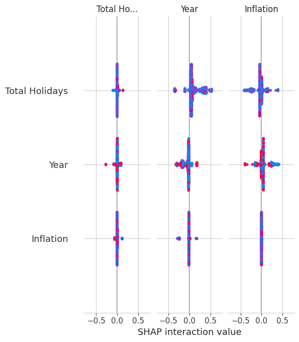

- **Weak Feature Interactions**: The SHAP interaction analysis reveals that feature interactions are minimal, with most interaction values centered around zero. This indicates that the key features, such as **Total Holidays**, **Year**, and **Inflation**, influence the model independently.
- **Total Holidays**: Shows a slight but noticeable interaction with its own feature, indicating a moderate impact on predictions. However, interactions with other features remain minimal.
- **Year & Inflation**: Both show negligible interaction, with SHAP values close to zero, confirming their independent contributions to predictions.
- **Even SHAP Distribution**: The distribution of positive (red) and negative (blue) SHAP values is balanced, suggesting that changes in feature values do not consistently lead to higher or lower predictions, further emphasizing that the model is driven more by individual feature contributions rather than feature interactions.

5. KNN (Classification/k-Nearest_Neighbours.ipynb)

6. SVM (Classification/support_vector_machines.ipynb)

## Analysis of Results
After experimenting with the various models, we compared our results and found that logistic regression and SVM appear to be the best based on accuracy, and both models have the same precision and recall. Hence to differentiate better, we did a 10-fold cross validation, and found that logistic regression is more balanced, with the mean accuracy of 0.9 so we pick logistic regression as the best model.

| Models               | Baseline Accuracy | Fine-tuned Accuracy |
|----------------------|------------------|---------------------|
| Logistic Regression | 0.9287           | 0.9688              |
| XGBoost             | 0.6793           | 0.6971              |
| Decision Tree       | 0.5768           | 0.6481              |
| KNN                 |                 |                       |
| SVM                | 0.8797           | 0.9688              |
| Random Forest      | 0.6748           | 0.8641              |

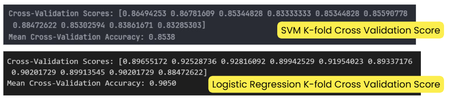

## Conclusion

Overall, our analysis revealed that geographical features are the strongest predictors of traffic class, indicating that regional factors like airport activity influence air traffic patterns. Inflation also play a role that potentially reduces travel demand. Time trends like year show how air traffic evolves due to economic cycles or events like pandemic. 
Relating back to our problem statement, airlines can think about ways to optimize flight routes and pricing based on regional and economic conditions. Airport authorities can also adjust operations based on geographic traffic patterns. 
Future works on this project can be on improving data quality by getting more data and explore other models lilke time-series models to better capture seasonal and trend-based patterns in traffic data. 
