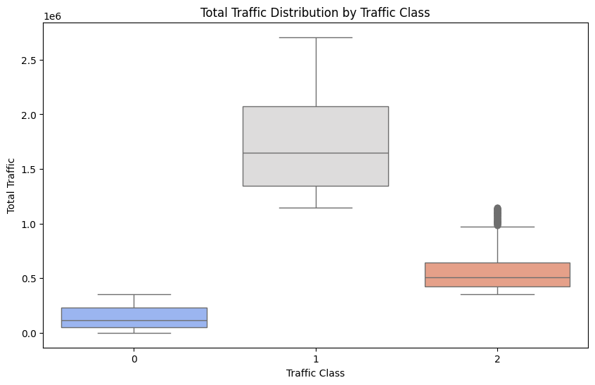

# Travel Trends in Singapore
This github repository consists of our machine learning project for module code INF2008.

## Problem Statement
This study aims to predict air passenger traffic volume to and from Singapore by analyzing historical arrivals, departures, number of public holidays in each month and inflation. By leveraging machine learning techniques, the research seeks to identify peak and off-peak travel periods, enabling airlines, travel agencies, and policymakers to optimize flight schedules, allocate resources efficiently, and enhance passenger experience. 

## Dataset
Our datasets that we decided to use are from the department of statistics singapore (singstat.gov.sg).

Departure: https://tablebuilder.singstat.gov.sg/table/TS/M650641

Arrivals: https://tablebuilder.singstat.gov.sg/table/TS/M650631

Inflation: www.timeanddate.com 

Inflation: https://www.kaggle.com/datasets/sazidthe1/global-inflation-data 

## Data Preprocessing 

Raw datasets are often structured in ways that make them difficult to analyze directly. In this project, we performed several preprocessing steps to make the data more suitable for analysis and modeling. These steps included:

- Reshaping data (Melting)

The original datasets for arrivals, departures and global inflation data was in a wide format so to make it easier to work with, we melted it to a long format using the following transformation:
```bash
    df_long = df.melt(id_vars=["Data Series"], var_name="Month_Year", value_name="Arrivals")
  ```

Refer to preprocessing/preprocessing.ipynb

- Web Scraping for Holiday 

Since the data was not readily available in a structured format, we collected the singapore holidays for the different years through web scraping.

Refer to preprocessing/Singapore_holidays.ipynb

## EDA

Refer to EDA/data_visualization.ipynb

In this section, we will perform Exploratory Analysis Data to gain insights on the relationship between features and the data itself to justify if the features are useful.

### Correlation Heat Map 


This graph is to present linear relationships between features. However after anlysising it, we discovered that the features does not have a strong relationship to one another. 

### Scatter Plot Holidays vs Total Traffics 


This analysis is to show the relationship and data dsitribution of total traffic across the years against number of public holidays. Although it does not show strong relationship or pattern, we can tell that more traffic resides during lesser holidays.

### Scatter Plot Inflation vs Traffic 


This analysis is to show the relationship and data dsitribution of total traffic against inflation rating. This shows a strong relationship where more flights occurs when inflation were low.

### Line Plot Arrivals last 10 years


This analysis is to show the relationship and data distribution of total traffic against inflation rating. This shows a strong relationship where more flights occurs when inflation were low.

## Feature Engineering

After cleaning the data and exploring the relationships between features using EDA. we proceeded with feature engineering stage where we select and created new features to be used for our later stages.

Feature added: 'Month_sin', 'Month_cos'

The Month column is converted into cyclic features using sine and cosine transformations. The reason for this transformation is that months are cyclical — December (12) is followed by January (1) — and treating them as a linear feature (e.g., just using 1 to 12) would lose the periodic nature of time.

The formula for each is shown below:

<p align="center">
    Month<sub>sin</sub> = sin( (2π × Month) / 12 )
</p>

<p align="center">
    Month<sub>cos</sub> = cos( (2π × Month) / 12 )
</p>

Feature added: 'Total_Traffic'

We added a new column that contains the value of the sum of 'Arrivals' and 'Departures'.

Selecting of features: We decided to use the newly added features, along with 'Year', 'Inflation' and 'Country' and 'Total Holidays' as from EDA, they have relatively strong relationship to total traffic volume. 

Refer to Classification/feature_engineering.ipynb

## Clustering

In this stage, we opt for KMeans as it is simple and fast to implement. To find the optimal number of clusters to use as the k-value, we used the elbow method. 

From the graph below, there is a 'bend' when k value is 3. 


However, it is not really clear whether 3 is really the best number to select so we also did a calculation of the silhouette score which can be useful tin finding the number of K when the elbow method doesn’t show a clear elbow point.

Typically, we will take the higher score once the elbow bends. 
From the scores, we can see that 3 is still the best one so we will take k value as 3 to perform our KMeans clustering. 


After performing KMeans, the labels are updated into our final dataset and saved into the column 'Traffic_class' which will be the target variable that we will input into our models later. 

We then plot a box-plot to visualise the difference between each cluster. From the graph, we can see that Cluster 0 represents low traffic volume, Cluster 1 represents high traffic volume and Cluster 2 is in the middle.



Refer to Clustering/clustering_kmeans.ipynb

## Classification

Finally, after generating the labels and updating our dataset, we went on to create and train models that could assist us with the classification task.

We first defined the features that we are going to use (X) : 'Total_Traffic', 'Departures', 'Arrivals', 'Traffic_Class', 'Month'

Our target variable (y) will be 'Traffic_Class'

We tried to implement several models.

1. Random Forest (Classification/randomforest.ipynb)

Random Forest is an ensemble learning approach and are more likely to be resilient to noise. 
The initial baseline accuracy of the test dataset after training is around 67% which is quite low so we made use of grid search to help us fine-tune the hyperparameters such as :

**n_estimators** : Specifies the number of decision trees. Higher values can increase model stability and reduces variance.
**max_depth** : Limits how deep each decision tree can grow. Higher depth captures more complex patterns

**max_features** : Determines how many features are randomly selected at each split.
**min_samples_split** : Represents the minimum number of samples required to split an internal node in a decision tree. Higher values prevent overfitting.

**min_samples_leaf** : Represents the minimum number of samples that must be present in a leaf node.
Setting a higher leaf size ensures the model focuses on meaningful patterns rather than noise.

**max_samples** : Proportion of the dataset sampled for each tree.
By lowering the values, increases tree diversity and reduce overfitting.

After fine-tuning, we ran the classifier against the training and testing dataset again, and realised that the accuracy has improved significantly from 67% to 86%. 
We then thought of using **SHapley Additive exPlanations (SHAP)** to help us interpret the model better and found that for Cluster 1, Inflation has a strong negative SHAP value, which shows that higher inflation reduces the predicted traffic volume.


The top features for each cluster reveal that "Country_South East Asia" is the most influential across all classes, especially for Class 1 and Class 2. "Year" consistently appears, indicating that time trends impact predictions. Inflation also plays a key role in differentiating low and high traffic volume clusters (Class 0 vs. Class 1).


2. XGBoost (Classification/xgboost.ipynb)

We also tried XGBoost which is an optimized gradient boosting algorithm that improves predictive performance by combining multiple weak learners (typically decision trees). It is designed for speed and efficiency.

The initial baseline accuracy of the test dataset after training is around 67% which is quite low so we made use of grid search to help us fine-tune the hyperparameters using gridsearch such as :

n_estimators: Defines the number of decision trees in the model.
Higher values can improve accuracy but may lead to overfitting.

max_depth : Controls how deep each tree can grow.
Deeper trees capture more complex patterns but may overfit.

learning_rate : Determines how much each tree contributes to the final prediction.
Lower values make learning slower but more stable.
Higher values learn faster but risk missing optimal solutions.

subsample : Controls random sampling of training data before growing each tree.
Lower values help prevent overfitting.

colsample_bytree : Controls random feature selection for training each tree.
It helps reduce correlation between trees, improving generalization.

After fine-tuning the accuracy increased to 69% but balanced accuracy was a decrease to 55%.
Hence, to ensure our samples are more balanced, we tried using SMOTE (Synthetic Minority Over-sampling Technique) which is a data augmentation technique used to address class imbalance in classification problems. It generates synthetic samples for the minority class rather than simply duplicating existing ones, helping machine learning models learn better from imbalanced datasets.

We trained and tested the model after applying SMOTE and found that accuracy improved slightly, increasing to 69%.

Still using SHAP to explain our classifier decisions, we plotted a force plot. 


The force plot above shows that total Holidays pushed the prediction higher while inflation, region, year, and month pushed the prediction lower.
This suggests that economic conditions (inflation) and seasonal effects (year/month) reduce traffic, while holidays increase it.


The bar graphs plotted show the top features plotted for each class and we can see that time-related features like Year, Month_sin, and Month_cos are consistently influential across all classes and geographical features affect traffic volume significantly, though their importance varies by class.

3. Logistic Regression (Regression/logistic_regression.ipynb)

4. Decision Tree (Classification/decisiontree.ipynb)

5. KNN (Classification/k-Nearest_Neighbours.ipynb)

6. SVM (Classification/support_vector_machines.ipynb)

## Analysis of Results
After experimenting with the various models, we compared our results and found that logistic regression and SVM appear to be the best based on accuracy, and both models have the same precision and recall. Hence to differentiate better, we did a 10-fold cross validation, and found that logistic regression is more balanced, with the mean accuracy of 0.9 so we pick logistic regression as the best model.

| Models               | Baseline Accuracy | Fine-tuned Accuracy |
|----------------------|------------------|---------------------|
| Logistic Regression | 0.9287           | 0.9688              |
| XGBoost             | 0.6793           | 0.6971              |
| Decision Tree       | 0.5768           | 0.6481              |
| KNN                 |                 |                       |
| SVM                | 0.8797           | 0.9688              |
| Random Forest      | 0.6748           | 0.8641              |


## Conclusion

Overall, our analysis revealed that geographical features are the strongest predictors of traffic class, indicating that regional factors like airport activity influence air traffic patterns. Inflation also play a role that potentially reduces travel demand. Time trends like year show how air traffic evolves due to economic cycles or events like pandemic. 
Relating back to our problem statement, airlines can think about ways to optimize flight routes and pricing based on regional and economic conditions. Airport authorities can also adjust operations based on geographic traffic patterns. 
Future works on this project can be on improving data quality by getting more data and explore other models lilke time-series models to better capture seasonal and trend-based patterns in traffic data. 